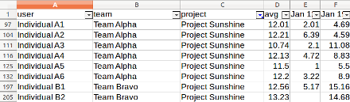
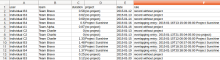
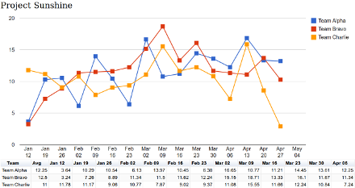

Toggl time report builder
=========================

Toggl.py is a time report builder, taking data from [Toggl](toggl.com) time tracker using [reports API](https://github.com/toggl/toggl_api_docs/blob/master/reports.md).

It was created for internal use by students in Software Engineering program and tailored for academic purposes. However, I will be glad to hear it is used in industry as well.

At the moment three types of reports are available:

- team time report, charts with weekly teams effort
- individual time report, CSV file
- time logging violations, CSV
- detailed report with all logged entries, CSV

Requirements
----

The only requirement is Python 2.4+.

This tool does not use any libraries besides standard functions. It does not use any kind of database or local storage to store past data, report is completely rebuilt for the given period every time. It introduces ~30 seconds of overhead for 6 month report period, which were sacrificed for tool portability and ease of use.


Setup
----

Get the code:

`git clone git@github.com:user2589/Toggl.py.git`

Then, adjust settings. There is an example settings file you can use as a template:

`mv settings.exapmple.py settings.py`

Following settings available:

- `api_token` - Toggl api token, you can find it in [toggl profile](https://toggl.com/app/profile). Good practice is to create a separate account with access to all monitored teams' workspaces.
- `start_date` and `end_date` - boundaries of the period monitored in `YYY-MM-DD` format. In academia we use semesters, for industry use you might consider quarters. 
- `core_courses` - projects you want to get separated in stats. Everything else will be aggregated to a single entity, which will be named by value of `everything_else` setting. It is named so because of the academic past of this tool.
- `everything_else` - see `core_courses` description
- `report date format` - data format to be used to name Mondays in weekly time report
- `template` - string that will be used to format output. Common practice is to read content of html template right in the settings file.


Detailed report
-----------

Detailed report is a CSV file with columns: user, team, project, start, duration. To generate detailed report, run:

    ./detailed_report > detailed.csv

If you serve CSV reports by a web service, there is a nice visualization of the detailed report (check out the [screenshot](docs/Details.png). Just put `detais.html` into the same folder as CSV files, under the webroot directory of the HTTP server. Usually, it is a good idea to restrict access to detailed and individual reports for privacy purposes, e.g. by using [htpasswd](https://httpd.apache.org/docs/2.4/programs/htpasswd.html) file for Apache2

Individual report
-----------

Individual report is a CSV file, generated from detailed report by aggregating records by users and reporting weeks.

Example individual report opened in LibreOffice:



To produce this report, run:

    cat detailed.csv | ./individual_report.py > individual.csv # if you already have a detailed report
    ./detailed_report | ./individual_report.py > individual.csv # if you don't have detailed report
    ./detailed_report | tee detailed.csv | ./individual_report.py > individual.csv # if you want to generate both

Logging violations report
-----

This report is a CSV list of suspicious time entries. It is generated by the script of individual report and printed to standard error output. What is treated as violation:

- overlapping time entries
- time entry stretching more than N hours (10 by default)
- time records without project

An example of violations report opened in LibreOffice:
    



To produce save this report into file, run:

    cat detailed.csv | ./individual_report.py 2> violations.csv # to produce logging violations report only
    cat detailed.csv | ./individual_report.py  > individual.csv 2> violations.csv # to produce both individual and violation reports at once
    ./detailed_report.py | tee detailed.csv  | ./individual_report.py 2> violations.csv > individual.csv # if you want to generate all three: detailed, individual and violations report

Team weekly time report
-----------

Team weekly report is HTML file with charts generated from individual report using template stored in settings.

Example of the report produced with default template:



To produce the report, run:

    cat individual.csv | ./team_report.py > team_report.html # output to a fixed file name
    cat individual.csv | ./team_report.py > `date +Week_%b%d.html`  # name report file by the date it is produced 
    
Putting it altogether:

    ./detailed_report.py | tee detailed.csv  | ./individual_report.py 2> violations.csv | tee individual.csv | ./team_report.py > `date +Week_%b%d.html`
    
    

Template for team reports
---------

This report produced by `team_report.py` using template. Template string is set in settings.template and it is just a format string. It is passed four variables for formatting in **JSON**:

- `week_labels` is a list of Mondays in `settings.report_date_format`. Example:
> ["Jan 12", "Jan 19", "Jan 26", "Feb 02", "Feb 09", "Feb 16"]   
- `teams` is a list of team names taken from Toggl. Example:
> ["Team Alpha", "Team Bravo", "Team Charlie"]
- `courses` list of courses from `settings.core_courses` plus one more entity named by `settings.everything_else`. If there are no time records for some project, it will not be included in report. Example:
> ["Project Sunshine", "Project Smile", "other stuffs"]
- `report_data` - actual report data in format `report.course.team.weekly_data`. Example: 
```
    {
        "Project Sunshine": {
           "Team Alpha": [3.64, 10.29, 10.54, nul, ...],
           "Team Bravo": [3.24, 7.26, 8.89, nul, ...],
            ...
        }, 
        ...
    }
```
Please note that default template contains a workaround not to count Spring Break towards total number of weeks. Look for `spring_break_idx` in template.html, set it blank if you don't need this feature.


License
-------

Distributed under [MIT License](opensource.org/licenses/MIT)
